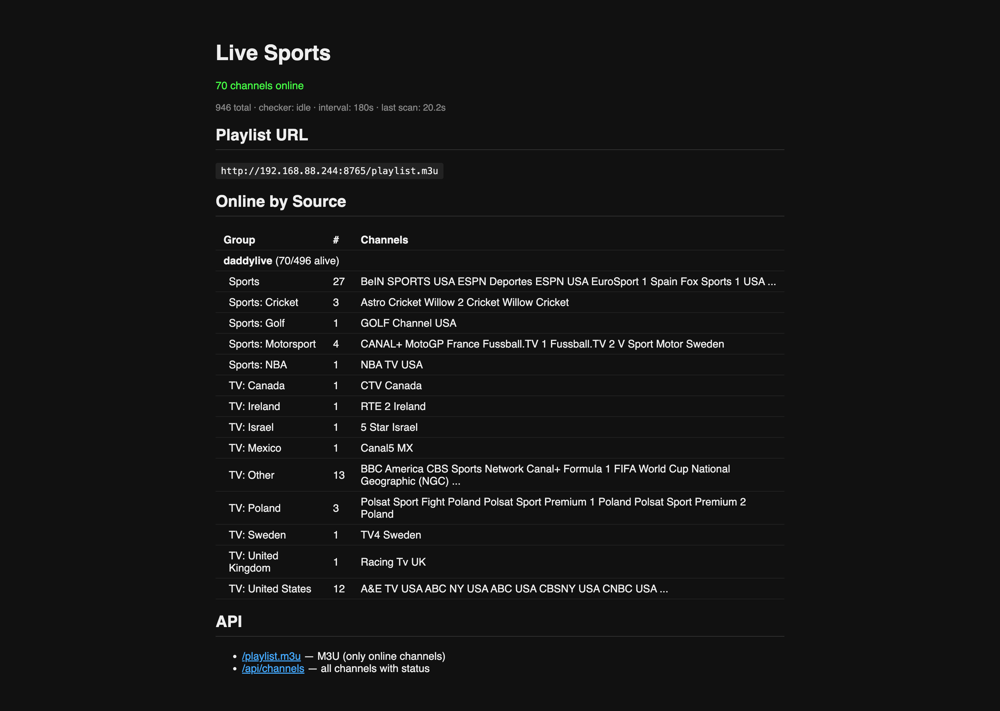

# Live Sports M3U Server

Multi-source live sports streaming server that aggregates channels from multiple providers, health-checks them, and serves an M3U playlist with an HLS proxy — designed for Apple TV (UHF app).



## How it works

1. **Fetches channels** from all sources on startup and every 30 minutes
2. **Health-checks** every channel by downloading a segment and running `ffprobe` to verify video + audio
3. **Serves an M3U playlist** with only working channels at `/playlist.m3u`
4. **Proxies HLS streams** through the server, handling referer/origin headers and URL rewriting so streams play on any client

## Docker

Pre-built multi-arch images (`amd64`, `arm64`, `arm/v7`) are available on GHCR:

```bash
docker run -d -p 8765:8765 ghcr.io/yowmamasita/live-sports:latest
```

Or with Docker Compose:

```yaml
services:
  live-sports:
    image: ghcr.io/yowmamasita/live-sports:latest
    ports:
      - "8765:8765"
    restart: unless-stopped
```

Images are automatically built and pushed on every commit to `main`.

## Local Setup

### Requirements

- Python 3.10+
- `aiohttp`
- `ffprobe` (part of ffmpeg)

### Run

```bash
pip install -r requirements.txt
python3 server.py
```

### Options

```
--port PORT              Server port (default: 8765)
--host HOST              Bind address (default: 0.0.0.0)
--check-interval SECS    Health check interval (default: 180)
```

## Endpoints

| Endpoint | Description |
|----------|-------------|
| `/` | Web UI with status dashboard |
| `/playlist.m3u` | M3U playlist (only alive channels) |
| `/stream/{channel_id}` | HLS proxy for a specific channel |
| `/api/channels` | JSON API with all channels and status |
| `/manifest.json` | Stremio addon manifest |
| `/catalog/tv/all.json` | Stremio catalog (all alive channels) |
| `/catalog/tv/all/genre={Genre}.json` | Stremio catalog filtered by genre |
| `/meta/tv/{id}.json` | Stremio channel metadata |
| `/stream/tv/{id}.json` | Stremio stream info |

## Categories

Channels are organized into groups for IPTV player navigation:

- `Live: Soccer`, `Live: Baseball`, etc. — active event streams
- `Sports` — 24/7 sports networks (ESPN, Sky Sports, beIN, DAZN, etc.)
- `TV: United States`, `TV: Germany`, etc. — TV channels by country

## Stremio

Install as a Stremio addon:

```
http://<server-ip>:8765/manifest.json
```

## Apple TV

Use the [UHF](https://apps.apple.com/app/uhf-iptv-player/id6502846354) app. Add the playlist URL:

```
http://<server-ip>:8765/playlist.m3u
```
